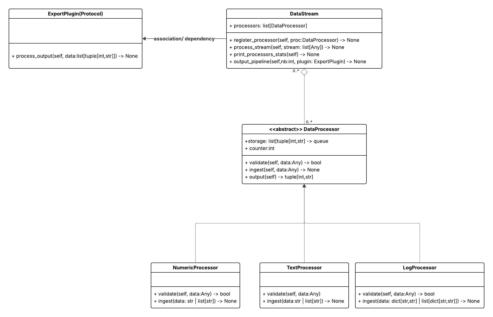

# Code-nexus-data-pipeline
Polymorphic data processing pipeline in Python using abstract classes and dynamic routing, with a plugin-based export system (CSV/JSON).

## Brief 

A modular data stream processing pipeline in Python that demonstrates polymorphism and abstraction using abstract base classes. It routes heterogeneous data to appropriate processors and uses a plugin-based architecture to support flexible output formats like CSV and JSON.

Key concepts demonstrated:

* Polymorphic data handling
* Abstract class design (ABC)
* Method overriding and type specialization
* Plugin architecture with duck typing
* Clean and modular system design

## What is abstract class ? 

-> It's a blueprint for any class that inherits from it to behave in a specific way, it could have concrete methods and abstract methods(the children must inherit it).

  *  Cannot be Instantiated: You cannot create an object directly from an abstract class.

  * Blueprint for Subclasses: It defines methods that subclasses must implement to become concrete (instantiable).

  * Mixed Methods: It can contain both abstract methods (which have no implementation) and concrete methods (which have a full implementation and can be inherited as-is).

  * Enforces a Contract: It ensures consistency across different subclasses, making it easier to maintain large codebases. 

## Class Diagram 

“output_pipeline → calls output → collects values → sends to process_output → plugin formats (CSV/JSON)”

* [Class-Diagram (In Lucid chart)](https://lucid.app/lucidchart/f296c209-ea0f-4eaf-af5f-77a629cb30e2/edit?viewport_loc=-331%2C-409%2C2087%2C1151%2C0_0&invitationId=inv_a8584705-0b0d-4a0d-969c-be8ecb2b28df)

## data_processor.py 

This file implements a modular data processing system using object-oriented design and abstract base classes. It defines a common interface for handling different types of data while allowing each processor to apply its own validation and transformation logic.

* The system supports processing:

  * Numeric data

  * Text data

  * Structured log data

All processors follow a unified workflow:
validate → ingest → store → output (FIFO)

## data_stream.py 

* Build an adaptive stream processing workflow that can han-
dle multiple data types simultaneously.

* Print the static of each processor handler.

## data_pipeline.py

* Print data after using the `self.ouput()` method, in CSV or JSON format, by using duck typing concept -> A concept where an object suitability for a task determined by it's method (behaviour) rather than by it's type or inheritance. 
It's like overriding but with less strict (if you quack then u are a duck).

